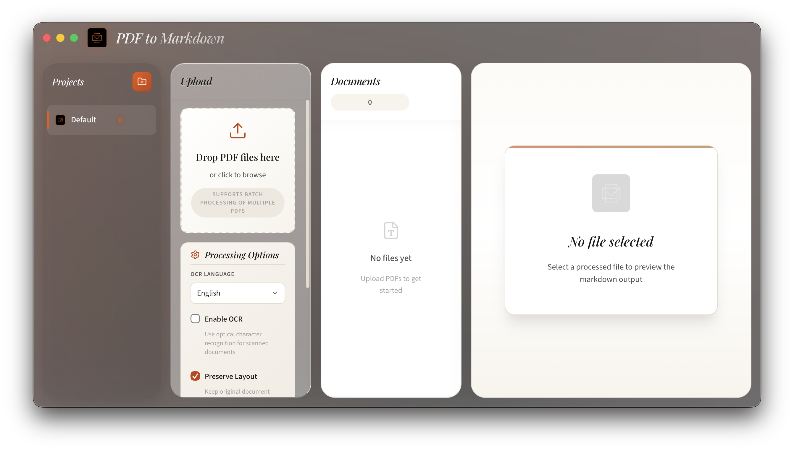

# PDF to Markdown

This is a desktop application built to convert PDF documents into clean, structured Markdown. It uses Tauri for the desktop environment and React for the interface, focusing on a tactile, skeuomorphic design.



## Core Features

- **Accurate Conversion**: Designed to extract text and preserve document layouts as much as possible.
- **Skeuomorphic Interface**: A custom-built UI that uses organic textures and liquid glass effects.
- **OCR Integration**: Uses Tesseract.js to handle text extraction from scanned documents.
- **Batch Processing**: Supports dragging and dropping multiple files for concurrent processing.
- **Project Structure**: A sidebar system to keep documents organized into different projects.
- **Live Preview**: Side-by-side view to check the Markdown output against the source PDF.

## Getting Started

### Prerequisites

You will need the following installed on your system:
- **Node.js**: The latest LTS version is recommended.
- **Rust**: Required for the Tauri backend.
- **System Dependencies**: You may need specific libraries depending on your OS. Refer to the [Tauri setup guide](https://tauri.app/v1/guides/getting-started/prerequisites) for details.

### Installation

1. Clone the repository:
   ```bash
   git clone https://github.com/mvxbn6usr1/pdf2mkdwn.git
   cd pdf2mkdwn
   ```

2. Install the project dependencies:
   ```bash
   npm install
   ```

3. Start the application in development mode:
   ```bash
   npm run tauri:dev
   ```

## Development and Tech Stack

- **Frontend**: React 19 and Vite with TypeScript.
- **Desktop Wrapper**: Tauri (Rust).
- **Processing**: MuPDF and PDF.js for document handling.
- **OCR**: Tesseract.js.
- **Styling**: Standard CSS with a focus on custom textures and shadows.

## Building for Production

To create a native executable for your current platform, run:

```bash
npm run tauri:build
```

## License

MIT © mvxbn6usr1
